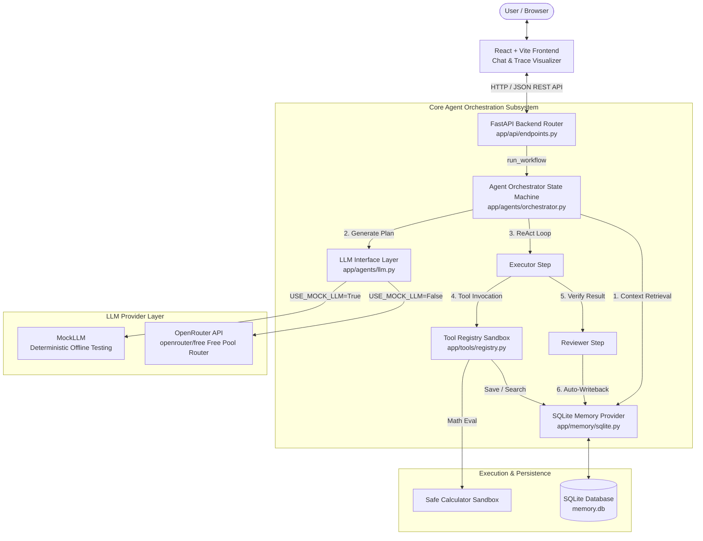
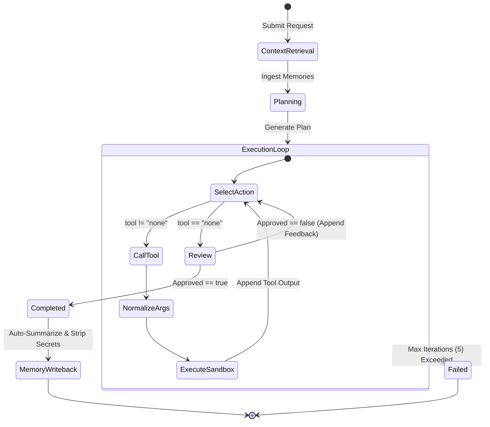
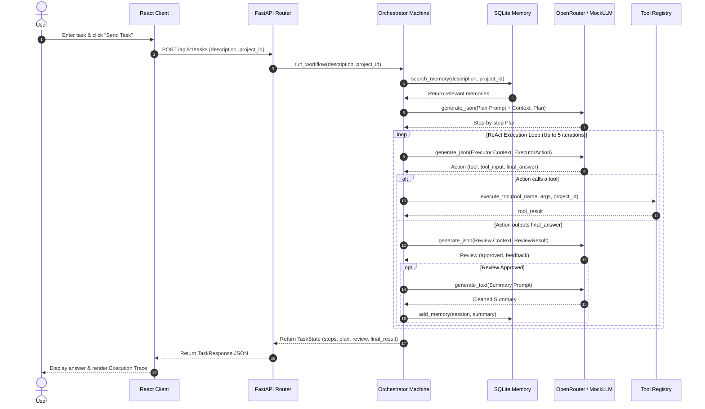

# Autonomous AI Agent Platform - System Architecture

This document outlines the software architecture, design patterns, data flows, and subsystem implementations of the **Autonomous AI Agent Platform**.

---

## 1. High-Level System Architecture

The platform follows a decoupled client-server architecture composed of a **React + TypeScript SPA frontend**, a **FastAPI backend**, an **agentic state machine orchestrator**, an **isolated tool execution sandbox**, a **pluggable memory layer**, and a **dual-mode LLM abstraction layer**.



---

## 2. Repository Structure

```
Paruppuvada-2.0-tathack-/
├── backend/                         # FastAPI backend service
│   ├── app/
│   │   ├── agents/                  # Multi-agent logic & LLM interfaces
│   │   │   ├── llm.py               # BaseLLM, MockLLM, OpenRouterLLM
│   │   │   └── orchestrator.py      # Planner -> Executor -> Reviewer loop
│   │   ├── api/
│   │   │   └── endpoints.py         # REST API endpoints & route handlers
│   │   ├── memory/                  # Persistence abstraction
│   │   │   ├── base.py              # MemoryProvider interface & data models
│   │   │   └── sqlite.py            # SQLite implementation
│   │   ├── models/
│   │   │   └── schemas.py           # Pydantic models for plans, actions, reviews
│   │   ├── tools/
│   │   │   └── registry.py          # Sandboxed tools & parameter normalizer
│   │   ├── config.py                # Pydantic Settings configuration
│   │   └── main.py                  # FastAPI application entrypoint & CORS
│   ├── tests/                       # Automated pytest test suites
│   │   ├── test_api.py              # API endpoint integration tests
│   │   ├── test_memory.py           # In-memory SQLite isolation tests
│   │   └── test_workflow.py         # Orchestrator & state machine tests
│   ├── cli.py                       # Terminal-based interactive runner
│   ├── live_tests.py                # Live verification suite for real OpenRouter APIs
│   └── requirements.txt             # Python dependencies
├── frontend/                        # React + TypeScript single-page application
│   ├── src/
│   │   ├── views/
│   │   │   ├── ChatWorkspace.tsx    # Interactive prompt interface & trace visualizer
│   │   │   ├── ProjectSelector.tsx  # Project creation & scoping selector
│   │   │   ├── MemoryExplorer.tsx   # Search, inspect, and delete memory records
│   │   │   ├── ExecutionHistory.tsx # Past task run history view
│   │   │   └── Settings.tsx         # Environment & connection status
│   │   ├── api.ts                   # Typed HTTP client for backend REST API
│   │   ├── types.ts                 # Shared TypeScript interfaces
│   │   ├── App.tsx                  # Root component & navigation state
│   │   ├── App.css                  # Component styling & layout rules
│   │   └── index.css                # Design system tokens, dark theme & glassmorphism
│   ├── package.json                 # Node.js dependencies & scripts
│   └── vite.config.ts               # Vite bundler configuration
├── project.md                       # Hackathon context, decisions & known issues
├── README.md                        # Project overview & quickstart guide
└── start_app.bat                    # One-click startup script for Windows
```

---

## 3. Subsystem Breakdown

### 3.1. Agent Orchestrator State Machine (`backend/app/agents/orchestrator.py`)

The orchestrator coordinates task execution through an explicit state machine without heavy external orchestration frameworks:

1. **Context Retrieval**:
   - Queries `MemoryProvider.search_memory(request, project_id)` before planning.
   - Injects matching historical memories into the planner prompt to provide cross-session and cross-task context.
2. **Planner Agent**:
   - Generates a structured [`Plan`](file:///c:/Users/allen/OneDrive/Desktop/New%20folder/Paruppuvada-2.0-tathack-/backend/app/models/schemas.py) object consisting of an overall goal and ordered discrete steps.
   - Enforces Pydantic schema validation.
3. **Executor ReAct Loop**:
   - Executes up to `MAX_ITERATIONS = 5` iterations to avoid runaway loops.
   - Evaluates the plan, prior step results, and available tool descriptions.
   - Decides whether to invoke a tool ([`ExecutorAction`](file:///c:/Users/allen/OneDrive/Desktop/New%20folder/Paruppuvada-2.0-tathack-/backend/app/models/schemas.py) with `tool` name and `tool_input`) or conclude with `tool="none"` and supply `final_answer`.
4. **Reviewer Agent**:
   - Validates the executor's `final_answer` against the initial user request.
   - Returns a structured [`ReviewResult`](file:///c:/Users/allen/OneDrive/Desktop/New%20folder/Paruppuvada-2.0-tathack-/backend/app/models/schemas.py) containing `approved: bool` and `feedback: str`.
   - If rejected, feedback is fed back into the executor loop for corrective action.
5. **Auto-Summary Writeback**:
   - Upon review approval, an automatic summary of the completed task is generated.
   - Includes safety checks against logging secrets or sensitive credentials.
   - Persisted as a `session` memory item tagged with `auto_summary`.



---

### 3.2. LLM Abstraction Layer (`backend/app/agents/llm.py`)

The platform decouples LLM calls through the [`BaseLLM`](file:///c:/Users/allen/OneDrive/Desktop/New%20folder/Paruppuvada-2.0-tathack-/backend/app/agents/llm.py) abstract base class:

- **`MockLLM`**:
  - Deterministic, zero-cost, offline fallback for local development and CI pipelines.
  - Generates predefined plans, calculator tool calls, and positive reviews without external network dependencies.
- **`OpenRouterLLM`**:
  - Leverages OpenRouter's OpenAI-compatible API endpoint (`https://openrouter.ai/api/v1`) using the official `openai` Python SDK.
  - Defaults to the OpenRouter Free Models pool (`openrouter/free`), dynamically routing tasks to high-capacity free community models (e.g., Llama-3.3-70B, Cohere North-Mini, Qwen, DeepSeek).
  - **Resilient JSON Parser**: Extracts structured JSON from standard responses as well as markdown fence blocks (` ```json ... ``` `).
  - **Incompatible Model Retry Guard**: OpenRouter's free pool occasionally routes to content moderation models (e.g. `nvidia/nemotron-content-safety`) which do not return instruction JSON. The layer detects non-compliant payloads and retries up to 3 times to obtain an instruction-following model.
  - **Dynamic Model Tracking**: Records `response.model` to track which specific LLM fulfilled each request.

---

### 3.3. Tool Sandbox & Registry (`backend/app/tools/registry.py`)

Tools are implemented as isolated Python functions registered in a central registry map:

| Tool | Parameters | Description & Security Boundary |
|---|---|---|
| `calculator` | `expression: str` | Evaluates mathematical expressions using a strict character whitelist (`0123456789+-*/(). `) and an empty `__builtins__` namespace. Arbitrary code execution and system calls are strictly blocked. |
| `save_memory` | `content: str`, `is_global: bool`, `tags: list`, `project_id: str` | Persists a piece of information into the active project or global memory space. |
| `search_memory` | `query: str`, `project_id: str` | Queries existing memory items by keyword matching across project and global scopes. |

- **Argument Normalizer**: Smaller or free-tier models may pass parameter aliases (e.g., `expr`, `calculation`, `math` instead of `expression`). The `execute_tool` router normalizes parameter names prior to execution.

---

### 3.4. Pluggable Memory Subsystem (`backend/app/memory/`)

Memory management implements the Provider pattern through [`MemoryProvider`](file:///c:/Users/allen/OneDrive/Desktop/New%20folder/Paruppuvada-2.0-tathack-/backend/app/memory/base.py), enabling seamless substitution of alternative backends (such as Vector DBs or Knowledge Graphs):

#### Data Isolation Tiers
1. **Global (`type="global"`)**: Shared across all projects and users (e.g., system instructions, general user preferences).
2. **Project (`type="project"`)**: Scoped to a specific `project_id`. Completely isolated from other projects.
3. **Session (`type="session"`)**: Scoped to individual task execution runs and automated post-task summaries.

#### SQLite Implementation (`backend/app/memory/sqlite.py`)
- Maintains tables: `projects` and `memory_items`.
- JSON-encoded tags list with keyword search support.
- **In-Memory Concurrency for Testing**: Pytest suites utilize shared in-memory SQLite URIs (`file:memdb_...?mode=memory&cache=shared`) with `uri=True` to bypass Windows file-locking issues (`WinError 32`).

---

### 3.5. REST API Layer (`backend/app/api/endpoints.py`)

| Endpoint | Method | Request Body / Query | Description |
|---|---|---|---|
| `/health` | `GET` | None | Service liveness probe |
| `/api/v1/projects` | `GET` | None | List all registered projects |
| `/api/v1/projects` | `POST` | `{"name": "string"}` | Create a new isolated project |
| `/api/v1/memory` | `GET` | `q` (optional), `project_id` (optional) | Query memories with keyword filtering and project scoping |
| `/api/v1/memory` | `POST` | [`MemoryItem`](file:///c:/Users/allen/OneDrive/Desktop/New%20folder/Paruppuvada-2.0-tathack-/backend/app/memory/base.py) | Store new memory record |
| `/api/v1/memory/{id}` | `DELETE` | `memory_id` path param | Remove memory item by ID |
| `/api/v1/tasks` | `POST` | `{"description": "...", "project_id": "..."}` | Dispatch new task to orchestrator workflow |

---

### 3.6. Frontend Single-Page Application (`frontend/src/`)

Built with React 19, TypeScript, and Vite. Adheres to a custom Vanilla CSS design system emphasizing modern aesthetics:
- **Design System Tokens (`index.css`)**: Dark slate palette (`#0f172a`, `#1e293b`), indigo/violet accent gradients, semi-transparent frosted glass (`backdrop-filter: blur(12px)`), and responsive layout containers.
- **Views**:
  - `ChatWorkspace`: Central interaction hub. Provides prompt dispatch, project selection header, and a side-by-side **Execution Trace visualizer** detailing agent thoughts, tool inputs/outputs, and reviewer decisions.
  - `ProjectSelector`: Project management interface for adding and selecting projects.
  - `MemoryExplorer`: Live memory inspection table with real-time search, tag badges, and deletion controls.
  - `ExecutionHistory`: Chronological log of past task executions.
  - `Settings`: Backend connectivity checks and configuration overview.

---

## 4. End-to-End Task Data Flow



---

## 5. Security & Isolation Model

- **Safe Tool Execution**: No shell or arbitrary Python `exec()` / `eval()` with globals. The calculator tool operates under an empty builtin scope with character whitelisting.
- **Secret Filtering**: Post-task memory summaries are instructed to redact API tokens and credentials prior to writeback.
- **Project Isolation**: Data queries enforce `project_id` matching, preventing data leakage between distinct hackathon projects.
- **Git Security**: Environment secrets (`.env`, `backend/.env`) are excluded via `.gitignore`.

---

## 6. Extensibility & Future Roadmap

1. **Vector RAG Provider**: Implement `VectorMemoryProvider` implementing [`MemoryProvider`](file:///c:/Users/allen/OneDrive/Desktop/New%20folder/Paruppuvada-2.0-tathack-/backend/app/memory/base.py) using Chroma or Qdrant for semantic vector search over ingested unstructured documents.
2. **Knowledge Graph Memory**: Add entity and relationship extraction (e.g. Graphify / Neo4j) to map interrelated project concepts.
3. **External Workflow Integrations (n8n)**: Expose n8n webhooks as tools in `registry.py` and trigger tasks via incoming webhooks.
4. **Human-in-the-Loop Gateways**: Pause execution on high-impact actions to await user authorization from the React trace panel.
