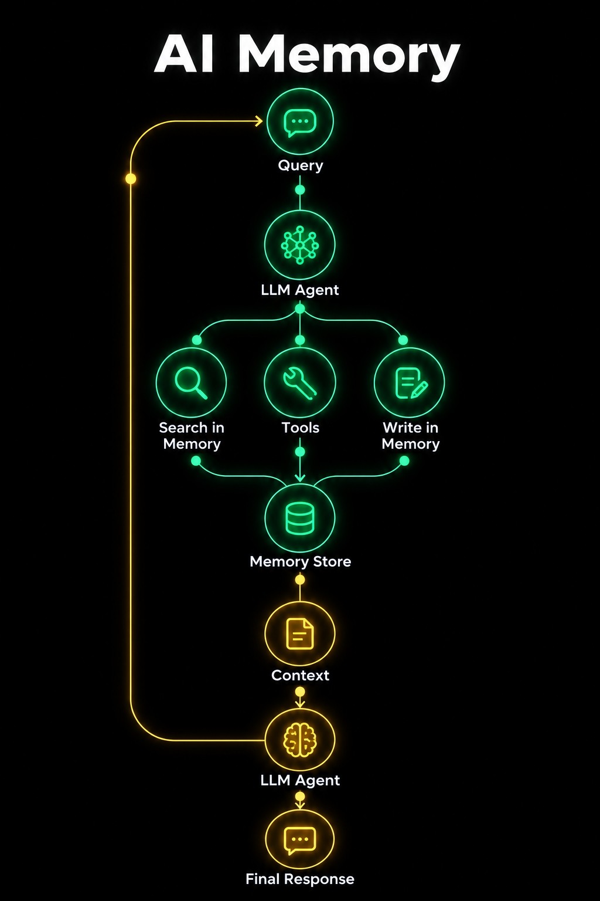
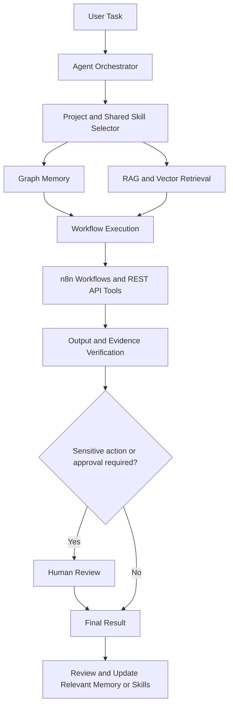

# Autonomous Agentic AI with Graph-Based Memory & Reusable Skills

> **Project status:** Early planning and development. The architecture and feature set will evolve as implementation progresses.

## Overview

We are building an **autonomous, multi-agent AI system** designed to complete real-world workflows end-to-end. The system aims to combine workflow orchestration, Retrieval-Augmented Generation (RAG), vector memory, graph-based project memory, reusable skills, and built-in security checks.

A key goal is to help the agent **learn from project work and reuse relevant knowledge safely**. Each project will have its own organized memory graph, while reusable skills and general knowledge can be shared across projects when relevant. For example, a future project may combine useful skills developed during two earlier projects instead of starting from scratch.

The system is intended to grow iteratively. Features described below are planned capabilities, not claims that they are already implemented.

## Problem We Are Exploring

AI agents can lose context between tasks, struggle to reuse lessons from earlier projects, produce unsupported answers, or be manipulated by instructions embedded in external content such as emails and documents. Their workflows can also become difficult to inspect as tools, memories, and steps accumulate.

Our goal is to create an agentic workflow system that can:

- Plan and run multi-step workflows from an initial task to a useful result.
- Retrieve relevant information from trusted sources using RAG.
- Organize knowledge into project-specific graphs and reusable skills.
- Select and combine relevant skills across projects.
- Verify important outputs and apply security checks before taking sensitive actions.
- Keep the process understandable through a graphical interface and workflow traces.

## Planned Features

### 1. Autonomous End-to-End Workflows

- Coordinate multi-step tasks through an agent orchestration layer.
- Use **n8n** to design and run workflows and connect supported services.
- Use REST APIs where integrations or external tools require them.
- Track workflow progress, outputs, errors, and actions that need review.

### 2. RAG and Vector Memory

- Ingest supported documents and other user-authorized sources.
- Split and index content so relevant information can be retrieved for a task.
- Use semantic retrieval and vector memory to bring relevant context into the workflow.
- Ground generated answers in retrieved evidence where possible and surface source references when available.
- Check important claims for evidence and flag information that cannot be verified, helping reduce hallucinations.

### 2.1 Proposed RAG and AI Memory Workflow

The following illustration represents the memory-enabled retrieval workflow we are exploring. It combines retrieval-augmented generation (RAG) with an agent that can search memory, use tools, and write useful information back to a memory store.



**Planned flow:**

1. A user submits a query or task.
2. The agent determines which memories or tools may be useful.
3. Relevant information is retrieved from the memory store and combined into context for the response model.
4. The model generates a response grounded in the available context where possible.
5. Useful new information may be proposed for memory, subject to relevance, provenance, and security checks.
6. Stored information can be retrieved in later workflows when it is relevant to the task.

This is a **proposed architecture**, not a claim that the complete pipeline is already implemented. RAG specifically refers to retrieving relevant information to support generation; persistent memory and writing information back are additional capabilities around that retrieval process. The implementation may evolve as we test the workflow.

### 3. Project-Specific Graph Memory with Graphify

Each project is intended to have a separate, structured memory graph. Using **Graphify** as part of the planned graph-based memory workflow, we aim to organize information into connected nodes and relationships, such as:

- Project goals, requirements, decisions, and constraints.
- Tools, libraries, resources, and implementation details.
- Problems encountered, solutions tested, and lessons learned.
- Deliverables, related concepts, and skills created during the project.

A GUI will make these project memory graphs easier to explore and manage. Keeping project memory organized should help the agent retrieve context that is relevant to the current project rather than mixing unrelated information together.

### 4. Reusable Skills and Cross-Project Learning

- Turn useful procedures, workflows, and lessons into reusable skills.
- Categorize and organize skills through a GUI.
- Maintain project-specific skills alongside shared skills that can be reused when appropriate.
- Let a new project select and combine skills from multiple previous projects. For example, Project 4 could reuse a skill from Project 1 and another from Project 3.
- Retrieve skills based on the current task, rather than loading every skill into every workflow.
- Review and refine candidate skills before making them available for future use.

### 5. General Knowledge and Skill Creation from Links

We plan to include a general knowledge area where a user can provide a supported link—for example, a GitHub repository or an accessible public webpage. The system may then:

1. Retrieve the content it is permitted and able to access.
2. Analyze the material and identify useful concepts, tools, and procedures.
3. Build a structured graph of the relationships between those concepts.
4. Propose reusable skills based on the extracted knowledge.
5. Allow the resulting knowledge or skill to be reviewed and categorized for future tasks.

Access to platforms such as social media will depend on their availability, permissions, and supported access methods. A link alone does not guarantee that the system can read its contents.

### 6. Security as a Built-In Agent Capability

Security is planned as part of the agent's workflow and reusable skill system, not as a separate standalone product. The agent should be able to select relevant security checks when a task or tool interaction requires them.

Planned safeguards include:

- **Prompt-injection resistance:** Treat emails, web pages, retrieved documents, and other external content as untrusted data rather than as instructions that can override the user's task or system policies.
- **Instruction hierarchy:** Preserve the priority of trusted system rules and user intent when processing external content.
- **Human-in-the-loop approvals:** Require explicit approval for selected sensitive or irreversible actions, and do not allow content being processed by the agent to bypass that approval requirement.
- **Permission-aware tool use:** Check whether an agent is allowed to perform an action before executing a tool or API call.
- **Data protection:** Limit access to information needed for the task and avoid exposing secrets or unrelated private data in outputs.
- **Hallucination and evidence checks:** Flag unsupported claims and use retrieved sources to validate important information where possible.
- **Audit trail:** Record relevant workflow steps, tool requests, approvals, and security decisions to help with debugging and review.

For example, if the agent processes Gmail content, an email may contain instructions designed to manipulate the agent. The intended behavior is to treat that email as content to analyze, ignore attempts to override trusted instructions, and block unauthorized actions. Integrations and enforcement rules will be tested as they are implemented.

### 7. Unified GUI for Projects, Memory, and Skills

The planned interface will help users:

- View and switch between projects.
- Explore each project's graph-based memory.
- Browse shared and project-specific skill categories.
- Inspect which memories or skills are relevant to a workflow.
- Review workflow progress, source information, and security-related decisions.
- Manage candidate knowledge and skills before reusing them.

## High-Level Architecture



This diagram describes the intended direction. The final architecture may change as components are evaluated and implemented.

## Technologies and Concepts Under Exploration

- **Agentic AI:** Multi-step planning, orchestration, and tool use.
- **n8n:** Workflow automation and service integration.
- **RAG:** Retrieval of relevant information to support task execution and responses.
- **Vector memory:** Semantic retrieval of useful context.
- **Graphify / graph-based memory:** Structured project knowledge and relationships.
- **REST APIs:** Integration with supported external services.
- **Human-in-the-loop controls:** Approval for selected sensitive actions.
- **Security skills:** Reusable checks for prompt injection, tool permissions, data handling, and output verification.
- **GUI:** A unified place to manage projects, memories, skills, and workflow status.

Specific libraries, databases, models, and deployment choices will be documented once selected.

## Current Project Progression (Implemented)

We have successfully completed Phases 1-5 of the baseline platform architecture:
- **Phase 1 (Backend Foundation):** Set up a modular FastAPI backend structure, MockLLM testing environment, configuration management (`.env`), and a robust pytest testing suite.
- **Phase 2 (Agent Orchestration):** Implemented a real Orchestrator-Worker pattern with three agent roles (Planner, Executor, Reviewer). Added strict JSON schema validation for all agent outputs and sandbox restrictions on tool execution.
- **Phase 3 (Persistent Memory & Isolation):** Integrated an SQLite-backed memory provider supporting Session, Project, and Global memory types. Added automatic contextual memory injection before planning and automatic task-summarization write-backs. Project contexts are strictly isolated.
- **Phase 4 (Frontend UI):** Built a desktop-first responsive React/Vite dashboard featuring a Chat Workspace, real-time Execution Trace panel, Project Selector, and a Memory Explorer. Connected the UI securely to the FastAPI backend.
- **Phase 5 (OpenRouter Free Models Integration & One-Click Launch):** Integrated OpenRouter's Free Models Router (`openrouter/free` via `https://openrouter.ai/api/v1`) using the OpenAI-compatible SDK. Added dynamic model ID detection, resilient JSON schema extraction with retry protection against non-instruct/moderation models, automated live verification tests (`backend/live_tests.py`), and a one-click launcher script (`start_app.bat`).

## Quickstart & How to Run

### Option 1: One-Click Startup (Windows)
Double-click `start_app.bat` or run:
```cmd
.\start_app.bat
```
This creates the backend virtual environment if needed, installs backend and frontend dependencies, waits for both servers to respond, and opens `http://127.0.0.1:5173` in your default browser. It starts in offline mock mode if no `backend/.env` is configured.

Tasks are solved independently by three concurrent agents with distinct roles: Direct Solver, Critical Thinker, and Research Synthesizer. With `USE_MOCK_LLM=False` and an OpenRouter API key in `backend/.env`, the agents use free models via `openrouter/free`; a fourth model call judges the candidates, and the selected answer is returned in chat. Configure `OPENROUTER_AGENT_MODELS` to choose specific free/open-weight model IDs. The execution trace displays each role, candidate, and selected answer. Mock mode produces clearly labelled role-specific simulated candidates.

When SQLite returns no matching memory, the backend automatically searches Bing's public web results and supplies titles, excerpts, and URLs to each solution agent. Agents are instructed to cite supplied source URLs; the execution trace displays the retrieved sources. Search is controlled by `WEB_SEARCH_ENABLED` and `WEB_SEARCH_MAX_RESULTS`. Because the task text is used as a public search query in this fallback, avoid submitting sensitive information.

### Option 2: Windows PowerShell Commands

#### Terminal 1 — Backend API
```powershell
cd backend
.\venv\Scripts\Activate.ps1
uvicorn app.main:app --reload --port 8000
```

#### Terminal 2 — Frontend UI
```powershell
cd frontend
npm run dev
```
Then open `http://localhost:5173` in your browser.

## Development Roadmap

- [x] Define the first end-to-end workflow and its success criteria.
- [x] Set up the initial agent orchestration. (n8n workflow integration pending)
- [ ] Build a basic RAG pipeline over a small, trusted document collection.
- [x] Connect retrieval, context assembly, response generation, and reviewed memory write-back into an end-to-end workflow.
- [ ] Prototype project-specific graph memory using Graphify.
- [x] Define a skill format and implement a basic skill categorization system.
- [ ] Prototype shared skills that can be reused across projects.
- [ ] Add general knowledge ingestion from supported, user-authorized links.
- [ ] Implement source-aware output checks and hallucination-reduction measures.
- [x] Add prompt-injection defenses and permission checks for tool execution. (Basic tool sandboxing complete)
- [ ] Add human approval for selected sensitive actions.
- [x] Build a GUI to explore projects, memory graphs, and skills. (React dashboard built, graph integration pending)
- [x] Test with normal tasks, incomplete information, malicious external content, and unsupported questions.
- [ ] Document setup, configuration, evaluation results, and deployment.

## Evaluation Goals

As implementation progresses, we plan to evaluate the system using measurable tests such as:

- Whether workflows complete successfully from start to finish.
- Whether RAG retrieves relevant supporting information.
- Whether the agent selects appropriate skills and reuses them correctly.
- Whether unsupported claims are flagged rather than presented as verified facts.
- Whether prompt injection in external content can trigger unauthorized tool actions.
- Whether human approval requirements remain enforced.
- Whether legitimate actions are incorrectly blocked.
- Whether workflow steps and security decisions can be inspected and reproduced.

Results will be added after the tests are implemented and run.

## Project Principles

1. **End-to-end execution:** Focus on completing useful workflows, not only generating chat responses.
2. **Relevant memory:** Retrieve the right project context and skills for the current task.
3. **Reusable knowledge:** Convert lessons into skills that can be reviewed and shared across projects.
4. **Evidence-based outputs:** Prefer grounded information and clearly communicate uncertainty.
5. **Security by design:** Treat external content cautiously and enforce permissions at action time.
6. **Human oversight:** Keep people involved in sensitive decisions and actions.
7. **Iterative development:** Test features, measure results, and update the architecture as we learn.

## Current Status

This repository is being prepared while the project scope and architecture are still evolving. We will update this README as features are designed, implemented, tested, or changed. Until a feature is demonstrated in the codebase, it should be considered planned rather than complete.

---

**Primary direction:** An autonomous, multi-agent AI system that combines end-to-end workflows, RAG, graph-based project memory, reusable cross-project skills, and integrated security and verification capabilities.
